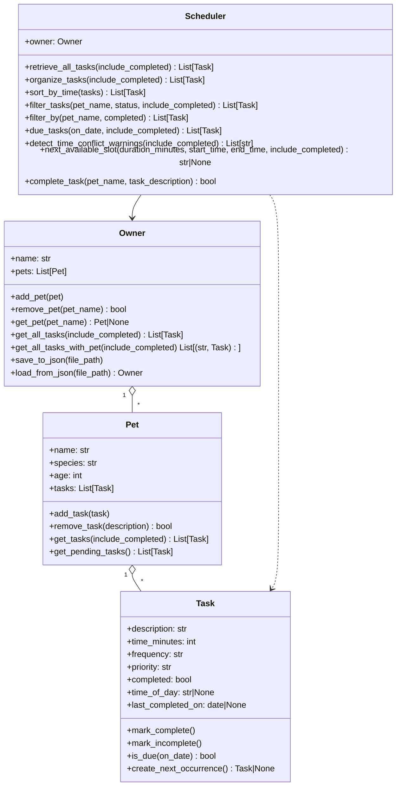
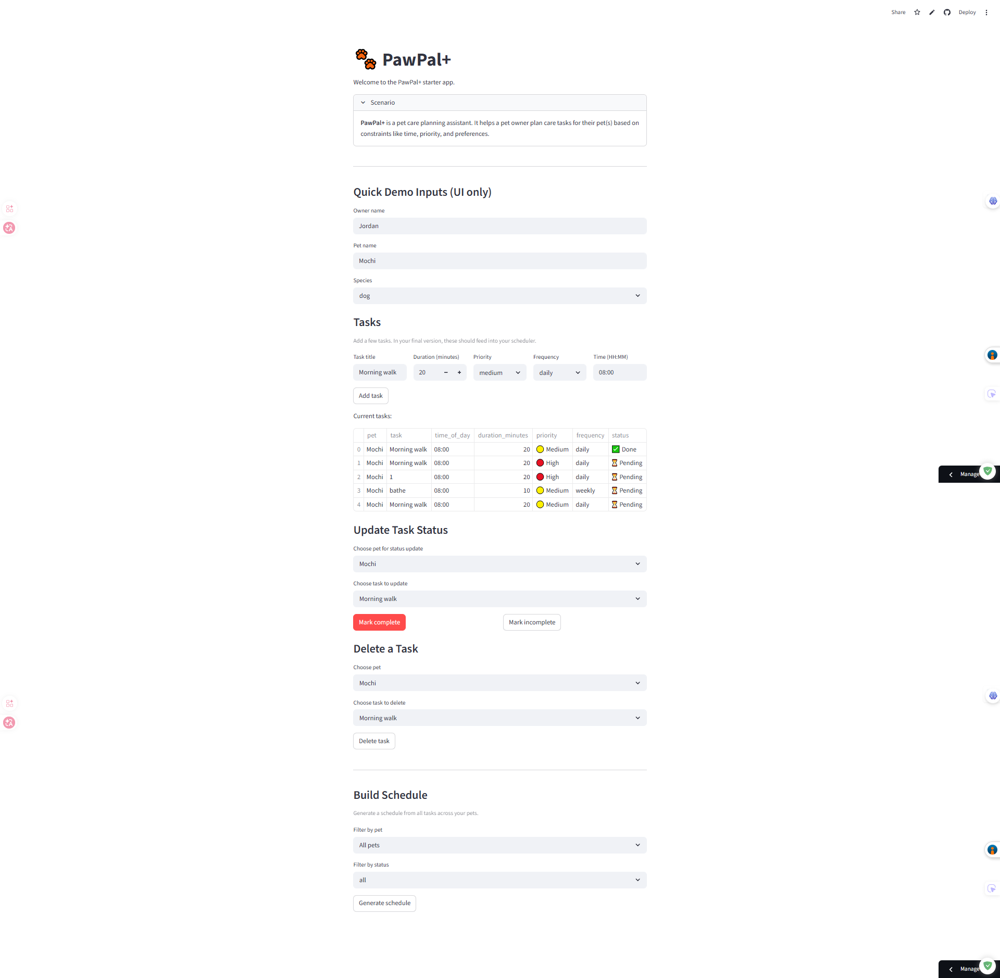

# PawPal+ (Module 2 Project)

You are building **PawPal+**, a Streamlit app that helps a pet owner plan care tasks for their pet.

## Scenario

A busy pet owner needs help staying consistent with pet care. They want an assistant that can:

- Track pet care tasks (walks, feeding, meds, enrichment, grooming, etc.)
- Consider constraints (time available, priority, owner preferences)
- Produce a daily plan and explain why it chose that plan

Your job is to design the system first (UML), then implement the logic in Python, then connect it to the Streamlit UI.

## What you will build

Your final app should:

- Let a user enter basic owner + pet info
- Let a user add/edit tasks (duration + priority at minimum)
- Generate a daily schedule/plan based on constraints and priorities
- Display the plan clearly (and ideally explain the reasoning)
- Include tests for the most important scheduling behaviors

## Getting started

### Setup

```bash
python -m venv .venv
source .venv/bin/activate  # Windows: .venv\Scripts\activate
pip install -r requirements.txt
```

### Suggested workflow

1. Read the scenario carefully and identify requirements and edge cases.
2. Draft a UML diagram (classes, attributes, methods, relationships).
3. Convert UML into Python class stubs (no logic yet).
4. Implement scheduling logic in small increments.
5. Add tests to verify key behaviors.
6. Connect your logic to the Streamlit UI in `app.py`.
7. Refine UML so it matches what you actually built.

## Smarter Scheduling

Recent scheduler improvements include:

- `sort_by_time()` to order tasks by `HH:MM` time values.
- `filter_by()` to filter tasks by pet name and completion status.
- Recurring task carry-forward: when a `daily` or `weekly` task is completed, the scheduler automatically creates a new pending instance for the next cycle.
- Lightweight conflict warnings for tasks scheduled at the same exact time, including cases across different pets.
- `next_available_slot()` to suggest the next open block for a new task.

## Features

- Multi-pet task management through `Owner`, `Pet`, and `Task` classes.
- Priority-first scheduling with `Scheduler.organize_tasks()` (High -> Medium -> Low, then time).
- Time-based schedule ordering with `Scheduler.sort_by_time()` using `HH:MM` task times.
- Flexible filtering by pet and completion state using scheduler filter methods.
- Recurrence support for daily and weekly tasks, including automatic next-instance creation.
- Conflict awareness with lightweight same-time warning messages for one or multiple pets.
- Due-task checks based on frequency and last completion date.
- JSON persistence via `Owner.save_to_json()` and `Owner.load_from_json()` so pets/tasks remain between app runs.
- UI readability upgrades with emoji-coded priority and status indicators.

## Agent Mode Notes

Agent Mode was used to implement and validate the scheduling logic in small, testable increments:

- Added backend algorithms first (sorting, recurrence, conflict warnings, next available slot).
- Wired backend methods into `app.py` so UI behavior directly reflects scheduler outputs.
- Added persistence with custom JSON serialization for nested owner/pet/task objects.
- Re-ran `python -m pytest` after each substantive change to catch regressions quickly.

## Updated UML (Mermaid)



## Testing PawPal+

Run the test suite with:

```bash
python -m pytest
```

Current automated tests cover:

- Chronological sorting of tasks by `HH:MM`.
- Recurrence behavior, including creating a new pending daily task after completion.
- Conflict detection for duplicate time slots.
- Basic filtering, due-task checks, and empty-task edge cases.

Confidence Level: `★★★★☆` (4/5) based on passing unit tests for key scheduling paths and edge cases.

## Demo
<a href="demo.png" target="_blank"></a>.
